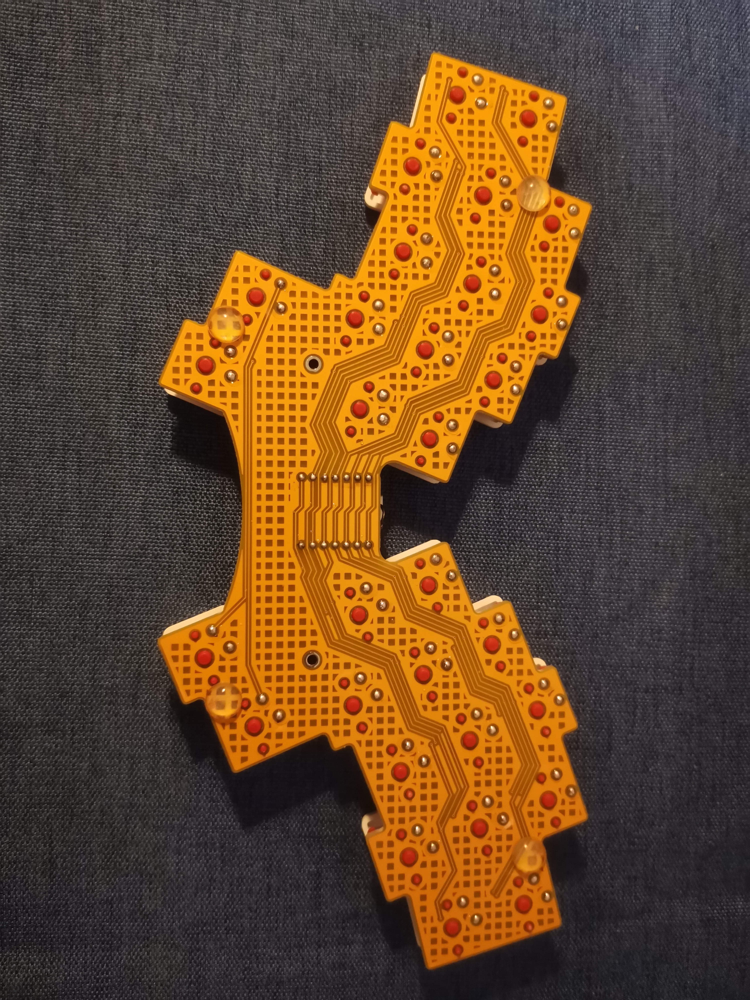
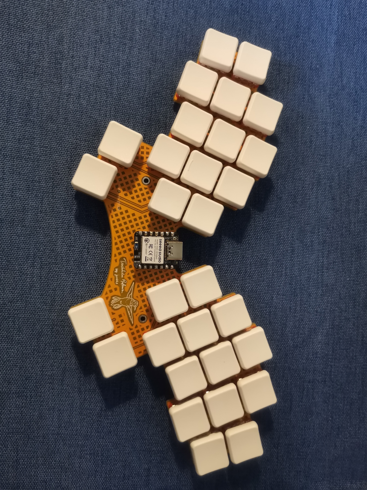
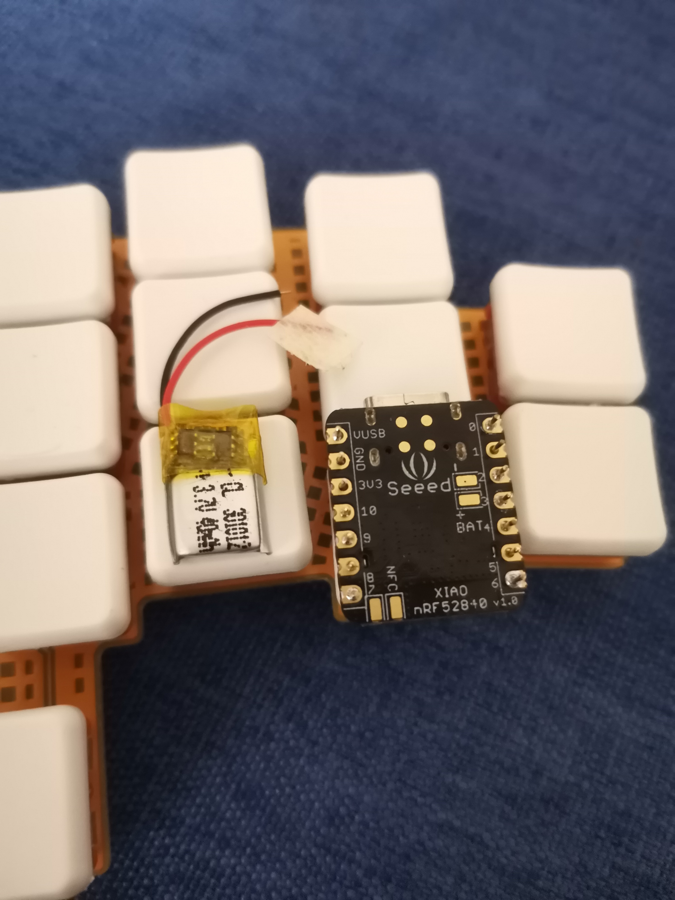

## Overview

The Hummingbird is a 30-key ergonomic split keyboard designed for extreme portability and minimal hand movement. Originally designed by rowanclarke, it has become popular among minimal keyboard enthusiasts for its unique layout and wireless capability.

## Key Features

- **Layout**: 30-key Hummingbird (ultra-compact split)
- **Key Count**: 30 keys total (15 per side)
- **Firmware**: ZMK wireless support
- **Controller**: Seeed Studio XIAO nRF52840
- **Power**: Integrated LiPo battery (3.7V)
- **Design**: Minimal ergonomic columnar layout

## Ergonomic Benefits

- **Ultra-compact**: Minimal hand travel distance
- **Columnar layout**: Keys aligned with natural finger positions
- **Split design**: Shoulder-width hand positioning
- **Wireless**: No cable drag, clean desk setup

## Technical Specifications

- 30 keys total with strategic key placement
- Seeed Studio XIAO nRF52840 controller
- Integrated 3.7V LiPo battery
- ZMK firmware with Bluetooth connectivity
- Custom orange PCB design
- Per-key RGB support (optional)

## Images

## References

- [GitHub - rowanclarke/hummingbird](https://github.com/rowanclarke/hummingbird)
- [Miryoku ZMK Hummingbird Keymap](https://github.com/manna-harbour/miryoku_zmk/blob/master/config/hummingbird.keymap)
- [KeymapDB - Hummingbird Keymaps](https://keymapdb.com/)
